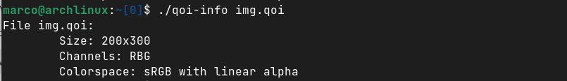

# qoi-info

Command line tool written in Rust that reads the [QOI format](https://qoiformat.org/qoi-specification.pdf) file header and prints the information in the standard output.

# How:

**Usage:** qoi-info [file].qoi

